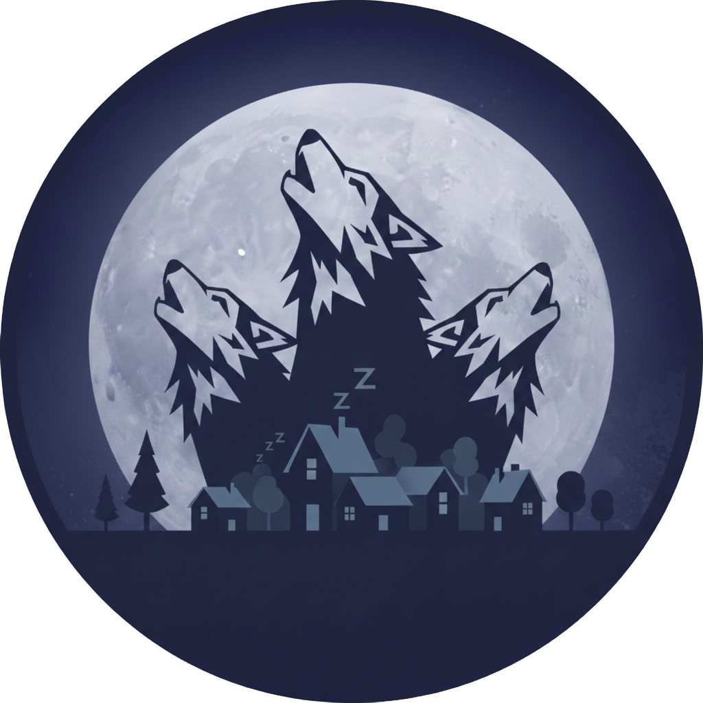

<p align="center">
  
</p>

<h1 align="center">Werewolf — Web Interface</h1>

<p align="center">
  <em>A premium, glassmorphic React frontend for the Werewolf social deduction game.</em>
</p>

<p align="center">
  
  
  
</p>

---

## Features

- **Online Multiplayer** — Create or join game rooms via Game ID. Real-time state sync through WebSockets (STOMP over SockJS).
- **Offline Narrator Mode** — A game-master-assisted mode for in-person gatherings. The narrator controls all phases from a single device.
- **Glassmorphic Design** — Dark theme with frosted-glass components, smooth transitions, and a responsive layout.
- **Real-time Updates** — Instant phase transitions, vote tracking, and role reveals via WebSocket subscriptions.

---

## Game Modes

### Online Mode

Each player connects from their own device. The backend manages turns, validates actions, and broadcasts state changes.

```
Player A (phone)  ──┐
Player B (laptop) ──┼──>  Spring Boot  ──>  Redis
Player C (tablet) ──┘      (WebSocket)     (state)
```

### Offline Mode

One device acts as the narrator. The game master selects actions on behalf of each role during the night, then facilitates discussion and voting during the day.

---

## Getting Started

### Prerequisites

- **Node.js** 20+
- **npm**

### Development (Frontend Only)

```bash
npm install
npm run dev
```

> Opens at [http://localhost:5173](http://localhost:5173). Requires the backend running separately for API/WebSocket calls.

### Full Stack (Recommended)

From the **project root**:

```bash
make run-web
```

> Launches backend, frontend, and Redis together. UI available at [http://localhost:3000](http://localhost:3000).

### Build for Production

```bash
npm run build
```

> Outputs optimized static files to `dist/`. In production, these are served by Nginx or bundled into the Spring Boot JAR.

---

## Available Scripts

| Script | Description |
|---|---|
| `npm run dev` | Start Vite dev server with HMR |
| `npm run build` | Type-check with `tsc` and build for production |
| `npm run preview` | Preview the production build locally |
| `npm run lint` | Run ESLint across the codebase |
| `npm test` | Run unit tests with Vitest |
| `npm run test:watch` | Run tests in watch mode |

---

## Project Structure

```
web/
├── public/
│   ├── favicon.png            # App favicon
│   ├── werewolf.png           # Logo asset
│   └── background.mp4         # Landing page background video
├── src/
│   ├── api/
│   │   └── gameApi.ts         # Axios HTTP client for REST endpoints
│   ├── components/
│   │   ├── common/            # Shared components
│   │   │   ├── Footer.tsx
│   │   │   ├── GameHeader.tsx
│   │   │   ├── PlayerCard.tsx
│   │   │   ├── VotingResults.tsx
│   │   │   └── WinnerAnnouncement.tsx
│   │   ├── game/              # Online game components
│   │   │   ├── GameBoard.tsx
│   │   │   ├── PlayersGrid.tsx
│   │   │   ├── RoleInfo.tsx
│   │   │   ├── TransitionScreen.tsx
│   │   │   ├── WaitingRoom.tsx
│   │   │   └── actions/       # Night & day action panels
│   │   │       ├── ActionArea.tsx
│   │   │       ├── DayDiscussion.tsx
│   │   │       ├── DayVoting.tsx
│   │   │       └── NightAction.tsx
│   │   └── offline/           # Offline narrator components
│   │       ├── OfflineControls.tsx
│   │       ├── OfflineGrid.tsx
│   │       ├── OfflineSetup.tsx
│   │       ├── TurnAnnouncement.tsx
│   │       └── controls/      # Game master control panels
│   │           ├── GameMasterControl.tsx
│   │           ├── PhaseControl.tsx
│   │           ├── TurnControl.tsx
│   │           └── VoteControl.tsx
│   ├── hooks/
│   │   ├── useOnlineGame.ts   # Online game state & WebSocket logic
│   │   ├── useOfflineGame.ts  # Offline game state & API calls
│   │   ├── useOnlineLobby.ts  # Lobby creation/joining
│   │   ├── useGameTransitions.ts  # Phase transition animations
│   │   ├── useConnectionQuality.ts  # WebSocket connection monitoring
│   │   └── __tests__/         # Hook unit tests
│   ├── types/
│   │   └── game.ts            # Game state & player type definitions
│   ├── pages/
│   │   ├── LandingPage.tsx    # Mode selection (Online / Offline)
│   │   ├── OnlineLobby.tsx    # Create or join a game room
│   │   ├── OnlineGame.tsx     # Online game view
│   │   └── OfflineGame.tsx    # Offline narrator view
│   ├── styles/
│   │   ├── components/        # Component-scoped CSS
│   │   └── pages/             # Page-scoped CSS
│   ├── test/
│   │   └── setup.ts           # Test environment setup
│   ├── App.tsx                # Router setup
│   ├── main.tsx               # React entry point
│   └── index.css              # Global styles & CSS variables
└── package.json
```

---

## Tech Stack Details

| Library | Version | Purpose |
|---|---|---|
| **React** | 19 | UI framework |
| **React Router** | 7 | Client-side routing (Landing, Lobby, Game pages) |
| **TypeScript** | 5.9 | Static type checking |
| **Vite** | 7 | Dev server with HMR & production bundler |
| **Axios** | 1.13 | HTTP client for REST API calls |
| **STOMP.js** | 7 | WebSocket messaging protocol client |
| **SockJS** | 1.6 | WebSocket fallback transport |
| **Vitest** | 4 | Unit testing framework |
| **Testing Library** | 16 | React component testing utilities |
| **Lucide React** | 0.563 | Icon library |
| **ESLint** | 9 | Code quality & linting |

---

## API Communication

The frontend communicates with the backend through two channels:

### REST API (`/api/`)

Used for game creation, joining, and action submission.

### WebSocket (`/ws/`)

Used for real-time game state updates. The client subscribes to game-specific STOMP topics and receives state pushes on every action.

> Nginx routes both `/api/*` and `/ws/*` requests to the Spring Boot backend. All other routes serve the SPA with `try_files` fallback.
